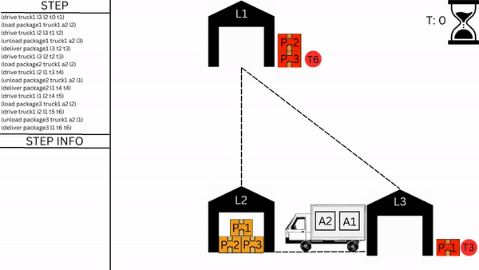

**PLANIMATION - 32-Degrees(TEAM 32)**
# COMP30022 - IT PROJECT
### Table of content
  - [Overview](#overview)
  - [Features](#features)
  

### Overview
This project aims to create a PDDL (Planning Domain Definition Language) animation for an existing domain problem. The animation will visualize the domain problem's states and transitions, enhancing the user's understanding and interaction with the PDDL model.

  

### Features
  - Custom-designed truck images for a unique animation experience
  - Integration with existing domain problem
  - User-friendly interface

### Contributors
- [Daniel Nappa](#https://github.com/DanielNappa)

